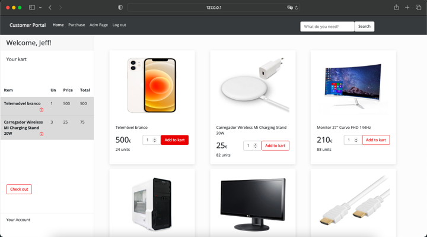
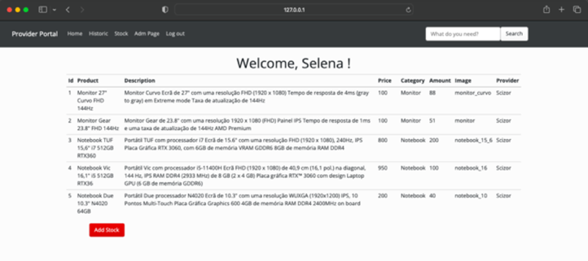
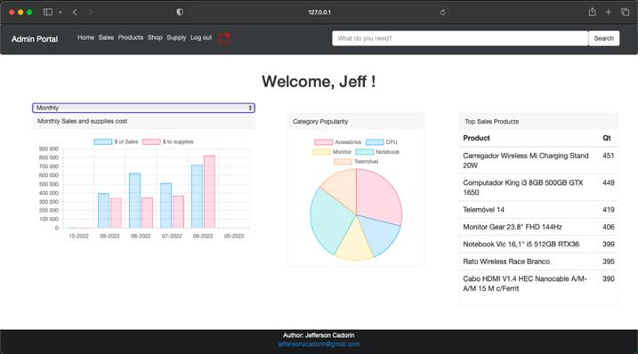
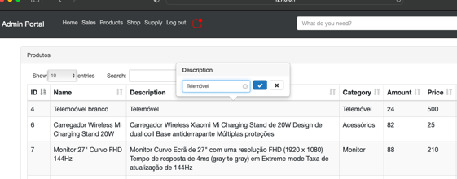

# Ecommerce Website

 Project made for my course conclusion in python module. It is a fictional informatic store  
 built with Python and HTML/CSS using packages as SQL and Flask.

## INTRODUCTION

* The main focus of this project is to show my skills with database management, query commands and  
python language in general, most of the website's interface I did with  
HTML and CSS, using bootstrap for a consistent grafic design.
* Graph Visualization built with JavaScript
* Client Data was created by faker function and product data was collected radomly in some real store  
to create a more realistic experience.  

## OVERVIEW
WebSite with a basic login page giving the possibility to three differents acess level (client, provider , administrator)  
each one with their own functionality, permissions, layout, informations and graphs.  
  
  
Customer main page  
  
  
### Customer:

  Each client have their own account information, purchase history and the option to hold products  
  on kart before make the purchase, even after log out. The Client page contains acess to:

 * Products Display
 * Kart Function
 * Account Information
 * Purchase History
 
 
### Provider:  
  Each provider has they own brand and products, having acess to their products sell history and  
  some other relevant graphs to see sell evolution over the time. The Provider page contains access to:
  
 * Sell Graphs 
     - Top sold itens of the provider's company
     - Provider's product sell history by day, week and month
     - Pie graph of sold product amount
 * Product Inventory 
     - Reposition function
 * Account Information
  
   
 Stock Reposition page 

### Administrator:    
Mother access having the permission to go through all the other access, incluiding the possibility to  
use all the functionality the others levels have, including the permission to do purchases as a client and  
to see the providers sells visualizations (When with provider access, have the vision of all the brands as one).  
The Administrator page contains access to:  
* Sell Visualization Graphs 
  - Top sold itens 
  - Product sell history by day, week and month
  - Pie graph of sold product amount
* Product create/edit/delete function
* Provider Painel acess like
* Customer Painel acess like  
  
  
Administrator main page.   
  
  
  
Item edition on adm page.   
   
   
   
   
   
   
 
 
 
